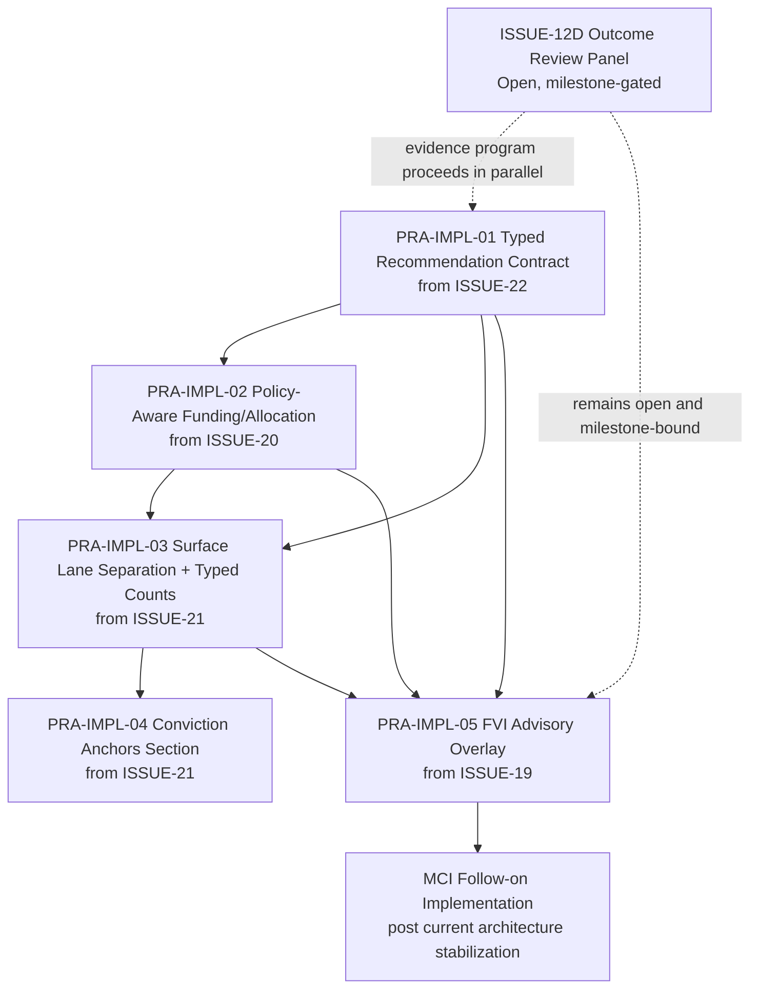

# Dependency Graph

Project: Security Intelligence Hub (SIH)  
Scope: Backlog implementation dependency model  
Date: 2026-06-07

## Dependency Model

## Build-First Sequence

1. PRA-IMPL-01 (typed contract)
2. PRA-IMPL-02 (policy-aware normalization)
3. PRA-IMPL-03 (surface lanes + typed counts)
4. PRA-IMPL-04 (conviction anchors section)
5. PRA-IMPL-05 (FVI advisory overlay)

## Parallelization Opportunities

Can run in parallel:
- ISSUE-12D evidence program with PRA implementation stream
- Early UX wireframing for PRA-IMPL-03 while PRA-IMPL-02 is in development

Cannot safely parallelize fully:
- PRA-IMPL-05 should not be finalized before PRA-IMPL-02 and PRA-IMPL-03 because it depends on policy-aware and typed-surface contracts.

## Governance Notes

- This graph is a recommendation artifact only.
- No GitHub issue modifications are performed in this package.
