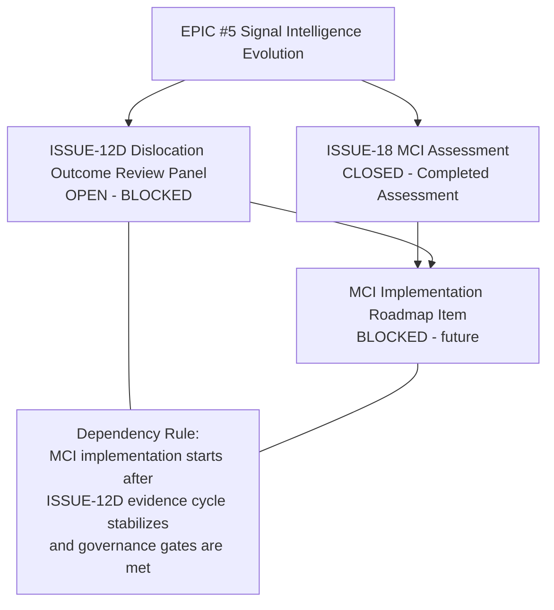

# ISSUE-18 Dependency Map

Repository: security-intelligence-hub  
Date: 2026-06-06

## Q3 — Should ISSUE-18 Remain Open?

Recommendation: A) Close immediately after assessment.

Why:
1. ISSUE-18 objective was assessment, and that objective is complete.
2. Keeping it open as a placeholder creates scope ambiguity (assessment vs implementation).
3. Implementation should be represented by a separate blocked roadmap issue tied to explicit evidence gates.

## Q4 — Relationship Between ISSUE-12D, ISSUE-18, EPIC #5

Interpretation:
- ISSUE-18 informs future MCI implementation but is not itself implementation.
- ISSUE-12D remains the higher-priority evidence program under EPIC #5.
- MCI implementation should remain blocked behind evidence/governance gates.

## Q5 — Milestone Recommendation for MCI

Yes, MCI should receive a milestone, but not the current Dislocation Calibration milestone.

Proposed milestone:
- Market Context Intelligence Readiness Review

Earliest start date:
- After ISSUE-12D execution window begins and first stable outcome-review cycle is complete
- Earliest practical planning start: Q1 2027

Dependency requirements:
1. ISSUE-12D implemented and operating with stable data quality.
2. At least two complete outcome cohorts available in the dislocation evidence system.
3. Governance approval of MCI Option A (informational-only) controls.
4. Deterministic signal-quality backtest for context labels completed.
