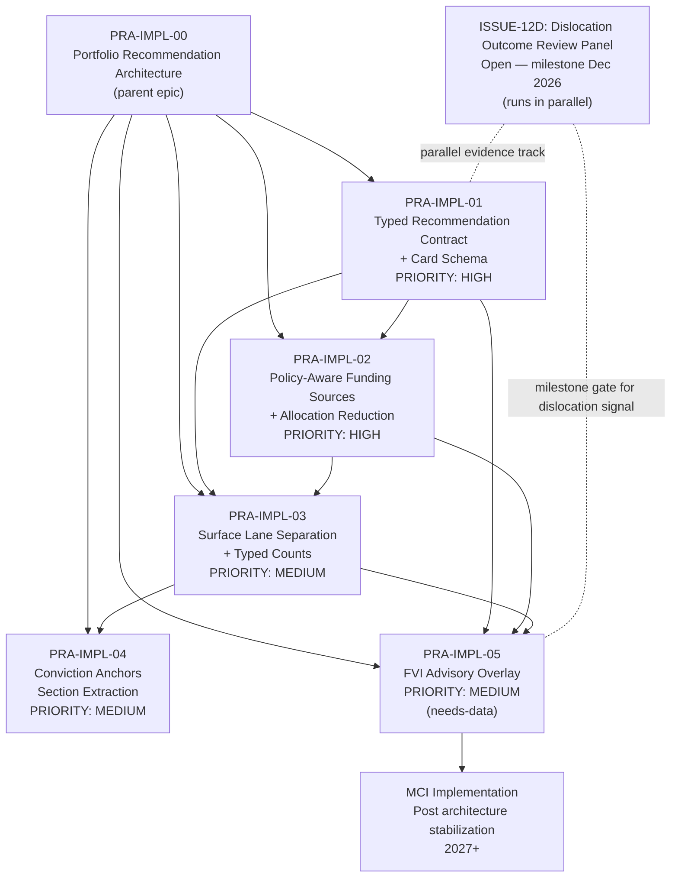

# PRA Implementation Dependency Graph

Project: Security Intelligence Hub (SIH)  
Type: Implementation sequencing model  
Date: 2026-06-08

## Full Dependency Graph



## Build Sequence (Serial Dependencies)

```
Step 1: PRA-IMPL-01  → foundation, no dependencies
Step 2: PRA-IMPL-02  → requires 01
Step 3: PRA-IMPL-03  → requires 01; benefits from 02
Step 4: PRA-IMPL-04  → requires 03
Step 5: PRA-IMPL-05  → requires 01, 02, 03 + peer group data config
```

## Parallelization Opportunities

| What | When |
|---|---|
| ISSUE-12D evidence collection | Always parallel with PRA-IMPL stream |
| UX wireframes for PRA-IMPL-03 lane design | During PRA-IMPL-02 development |
| Peer group config for FVI | During PRA-IMPL-03/04 development |
| MCI design exploration | After PRA-IMPL-03 is stable |

## Critical Path

PRA-IMPL-01 → PRA-IMPL-02 → PRA-IMPL-03 → PRA-IMPL-04 → PRA-IMPL-05

## Blocking Conditions

| Child | Blocks If |
|---|---|
| PRA-IMPL-01 | Not delivered before any other child |
| PRA-IMPL-02 | FVI overlay misleads without policy state normalization |
| PRA-IMPL-03 | FVI and anchor labels inflate counts if surface isn't typed |
| PRA-IMPL-05 | Blocked if peer group config not created |

## External Dependencies

| Issue | Relationship |
|---|---|
| ISSUE-12D | Independent evidence program; informs future dislocation signal influence on FVI phase-2 |
| ISSUE-19 | Design record for PRA-IMPL-05 |
| ISSUE-20 | Design record for PRA-IMPL-02 |
| ISSUE-21 | Design record for PRA-IMPL-03, 04 |
| ISSUE-22 | Design record for PRA-IMPL-00, 01 |
